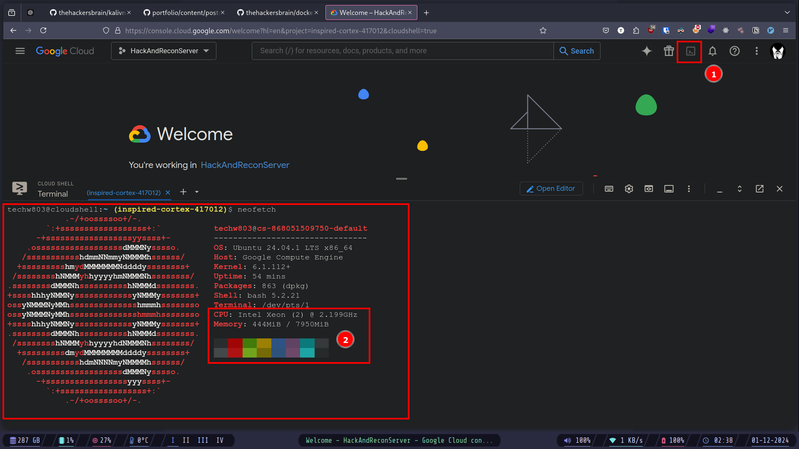
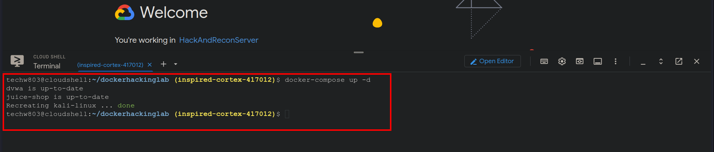
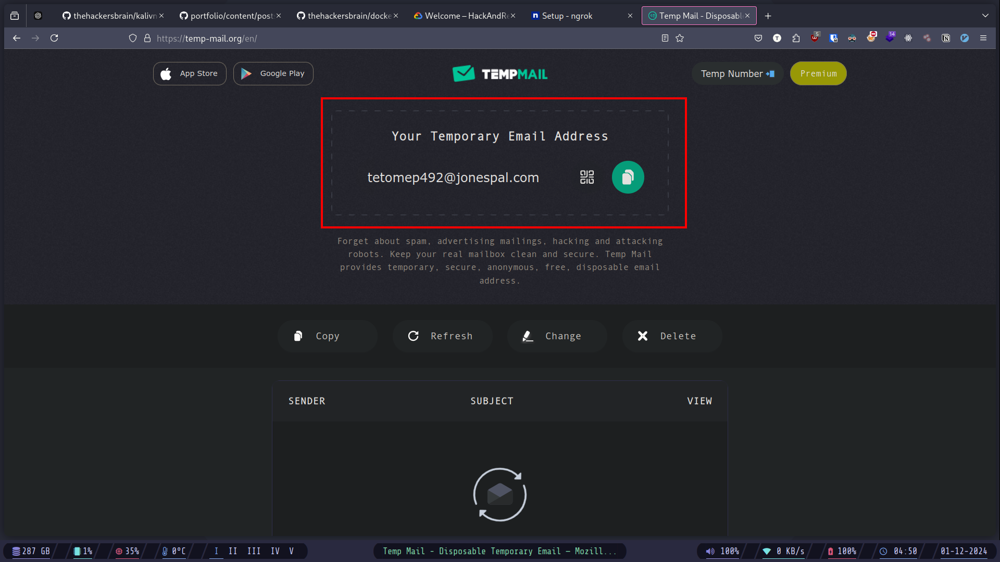
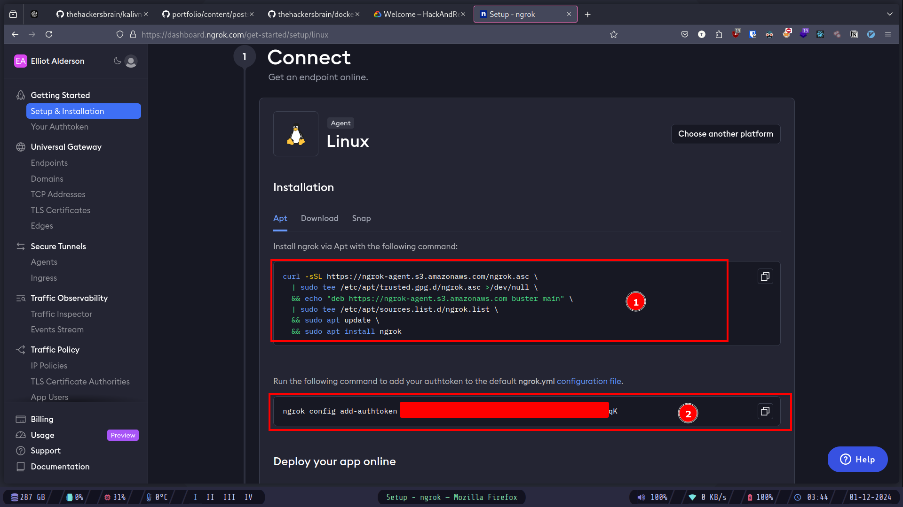
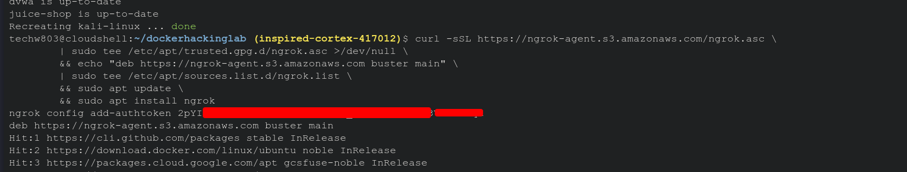
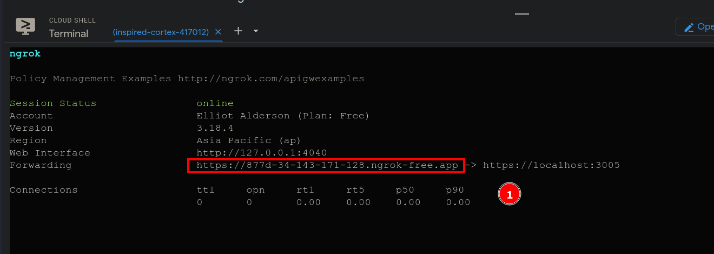
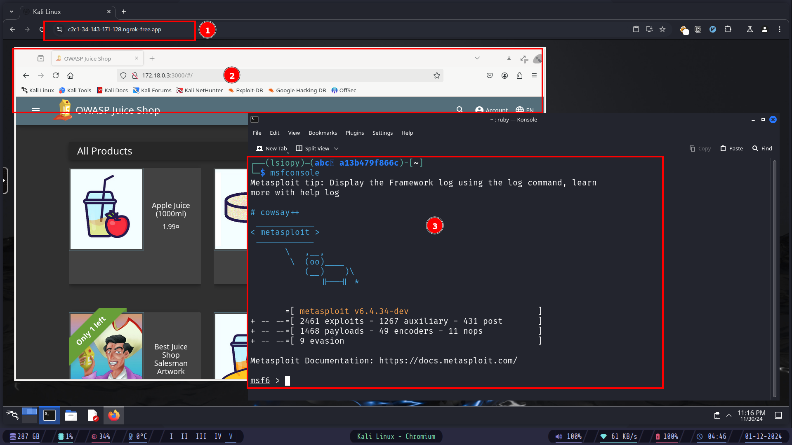

# Introduction

Hello Everyone! I'm Gaurav, A Security Researcher and a Developer. Recently, I've been using `Docker` and Cloud platform like `AWS` and `GCP` quite a lot due to the recent project I was working on as a Developer. While I had my developer's hat on, I thought, why not create a lab as IaC (_Infrastructure as Code_) using docker.

It wasn't a planned project, more like a curious and out-of-the-blue thought.

For those who don't know what `docker`, `AWS`, and `GCP` are. Let me give you a bit of context here.

## Docker, Vagrant, and Cloud Platforms.

**Docker** is a tool that helps developers and system administrators to create, deploy, and run applications inside `containers`. However in the context of this project (creating our own hacking lab on cloud) you don't have to completely understand or know your way around `docker`.

But keep in mind if you want to be a Developer, or Security Researcher or let's just say anything in the tech industry involving coding, programming, development or testing. I would say `docker` is a must. Go ahead and learn it **NOW**! I assure you even if you don't use it everyday, you're not going to regret learning it. And as for me, I completely love `docker`.

I play with systems and codes a lot so needless to say I use `docker` and `vagrant` a lot.

> **Vagrant** is an open-source tool that helps you create and manage virtualized development environments. It allows you to easily set up and configure virtual machines (_VMs_) on your computer using simple configuration files.
>
> I always keep a lot of `Vagrantfile` (configuration files for vagrant to create a VM) for different things with my configurations like for `kali-linux`, `arch-linux`, `tails-os`, and more.
>
> To quickly spin up a VM whenever I need.
>
> The same goes for `docker` as well.

In the context of development and deployment, engineers use `docker` extensively. Now you'll say - Okay, I get it, `docker` is awesome and all, but I'm not really in programming, development or anything like that, I'm really into cybersecurity.

Okay, got that! Let's take a look at docker and cybersecurity.

### Docker and Cybersecurity

In the context of cybersecurity, **Docker** can also be helpful, for example:

- **Isolation of Threats**: Docker containers isolate applications, reducing the risks of attacks spreading to other systems.
- **Securing Containers**: Understanding Docker helps secure containers and prevent vulnerabilities.
- **Rapid Incident Response**: Docker allows quick setup of environments for investigating security incidents.
- **DevSecOps Integration**: Docker is key in integrating security into the development and deployment process.
- **Staying Up-to-Date**: Docker is widely used in modern infrastructure, so learning it keeps you relevant in cybersecurity.
- **Understanding Orchestration**: Docker is essential for securing container orchestration platforms like Kubernetes.

#### Resources for learning docker

- [Complete Docker Course - From BEGINNER to PRO! - Youtube](https://youtu.be/RqTEHSBrYFw)
- [Docker Tutorials, Projects - NetworkChuck - Youtube](https://www.youtube.com/watch?v=dH3DdLy574M&list=PLIhvC56v63IJlnU4k60d0oFIrsbXEivQo)

Okay, now we know what we are going to use to setup our hacking lab. The second thing is where?

## Cloud Platforms (GCP, AZURE, AWS etc.)

There are tons of cloud platforms out there, if you can afford it, that's awesome. Some suggestions? Here you go

- [DigitalOcean](https://www.digitalocean.com/)
- [Linode](https://www.linode.com/)
- [IBM Cloud](https://www.ibm.com/cloud)
- [AWS](https://aws.amazon.com/)
- [Azure](https://azure.microsoft.com/en-in)
- [GCP](https://cloud.google.com/?hl=en)

All of the platforms listed above provide some credits or free-tiers to use. If you have access to a credit card. You can take the free-tier or credits on all of them. And to think that if you stay within limits and use them wisely you can get almost 5 years of free cloud servers, combining all of them with just one credit card. That's freaking awesome! Isn't it?

So go on ahead, create an account on any of them, and sign up for either the free-tier or credits.

Now that we covered what and where of the lab. Let's tackle the HOW?

# Setup

For the lab setup, the vulnerable applications are:

- [DVWA](https://github.com/digininja/DVWA)
- [OWASP Juice Shop](https://owasp.org/www-project-juice-shop/)

> I'm planning to add more vulnerable applications on the mix, but that's it for now. Atleast it's a starting point for those who know how to do it and extend this project further ahead.

and for the attacking machine, we are going to use:

- [Kali Linux](https://kali.org)

## The Files structure

The only file you're going to need is the `docker-compose.yaml` file, which is already uploaded on github, you can find it [here](https://github.com/thehackersbrain/dockerhackinglab).

Here's the complete file structure for the projects.

```bash title="github.com/thehackersbrain/dockerhackinglab" caption="File structure"
.
├── docker-compose.yaml 
└── README.md

1 directory, 2 files
```

- `docker-compose.yaml`: This file will run the lab with _Kali Linux_ on the Web and other vulnerable applications.

### The `docker-compose.yaml` file

Here's the complete `docker-compose.yaml` file with explainations.

```yaml title="docker-compose-web.yaml" caption="docker compose file" showLineNumbers
version: '3.7'

services:
  kali-linux: 
    image: lscr.io/linuxserver/kali-linux:latest
    container_name: kali-linux
    networks:
      security_network: 
        ipv4_address: 172.18.0.4 
    security_opt:
      - seccomp:unconfined
    environment:
      - PUID=1000
      - PGID=1000
      - TZ=Etc/UTC
      - SUBFOLDER=/
      - "TITLE=Kali Linux"
    volumes:
      - /path/to/data:/config
      - /var/run/docker.sock:/var/run/docker.sock
    ports: 
      - 3004:3000 
      - 3005:3001 
    shm_size: "1gb"
    restart: unless-stopped

  dvwa: 
    image: vulnerables/web-dvwa:latest
    container_name: dvwa
    networks:
      security_network: 
        ipv4_address: 172.18.0.2 
    ports:
      - "8888:8888" 

  juice-shop: 
    image: bkimminich/juice-shop:latest
    container_name: juice-shop
    networks:
      security_network: 
        ipv4_address: 172.18.0.3 
    ports:
      - "3000:3000" 

networks:
  security_network: 
    driver: bridge
    ipam:
      driver: default
      config:
        - subnet: 172.18.0.0/16 
```

##### Attacking Machine

- `kali-desktop`: running kali linux out attacking machine.
  - `security_network:`: connecting to the bridged NIC
    - `ipv4_address: 172.18.0.4`: assigning static IP.
  - `ports:`: mapping ports to the host to connect to the container.

##### Vulnerable Labs

- `dvwa`: running Damn Vulnerable Web Application (DVWA)

  - `security_network`: connecting to an isolated local NIC
    - `ipv4_address: 172.18.0.2`: assigning static IP (so that we don't have to guess the IP everytime).
    - `ports`: mapping the ports to the host

- `juice-shop`: running OWASP Juice Shop (the vulnerable web application)
  - `security_network`: connecting to an isolated local NIC
    - `ipv4_address: 172.18.0.2`: assigning static IP (so that we don't have to guess the IP everytime).
    - `ports`: mapping the ports to the host

##### Other Configurations

- `networks`: creating a custom NIC
  - `security_network`: naming the NIC
    - `internal: true`: making it an internal and isolated network so that, it can't be reached by other systems.
    - `subnet: 172.18.0.0/16`: assigning custom IP Range.

# Running the Lab

Now that we have everything out of the way, let's just run the lab.

For that we're going to use Google Cloud Platform (_GCP_). To get a free Linux VPC without a credit card. Let's get it now!

Open this url [here](https://console.cloud.google.com/welcome?hl=en)



- After visiting the url
  1.  Click on the terminal icon on top-right
  2.  It'll take some time but you'll get a terminal, and here we go, we got a free linux VPC and a pretty powerful one at that.

Now copy-paste these lines in the terminal.

```bash
$ git clone https://github.com/thehackerbrain/dockerhackinglab.git
$ cd dockerhackinglab
$ docker-compose up -d
```



This is going to take a while, so sit back and have a coffee or grab a quick snack.

Now that we have our lab running, it's time to connect to it, but there's a problem. As the **cloud-console** is not exposed on the internet, we can't just connect to it directly, we'll have to setup `port-forwarding`.

It's not that hard, just a few simple steps and we'll be there.

For setting up port forwarding we are going to use a free service called [ngrok](https://dashboard.ngrok.com/signup). So go ahead and create a free account.

You can use any temporary email to create the account. For example: [temp-mail.org](https://temp-mail.org/en)



After creating an account and logging in, you'll be redirected to the dashboard.



- Now go ahead and paste these commands in the Google console.



Now go ahead and run this command.

```bash
$ ngrok http https://localhost:3005/
```



After running the command, you'll get this url, now open the url.



1. And here we go, after visiting the url, we got our attacking machine.
2. Testing our vulnerable labs by visiting '`http://172.18.0.3:3000`' which is the OWASP Juice Shop url, and it running as well.
3. We have access all to the installed tools, as well as the Internet so that we can install any tools we desire.

Thanks for making it this far. If you get stuck, something errors out, or just want to say hi. DM me on X (formally _twitter_) at [@thehackersbrain](https://x.com/thehackersbrain).